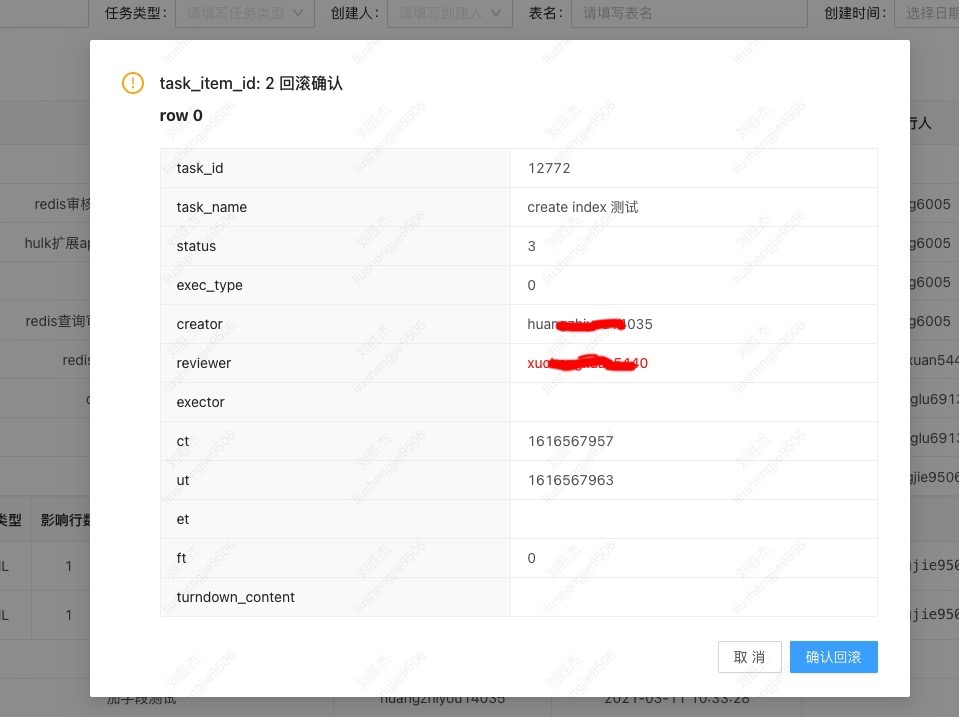

 
关键词： sql审批、sql检测、sql执行、备份

### 概要
这里主要是向大家推荐一款sql检测、审批工具Owls，用于自动检测、审批sql的执行，还有其他的审批、备份、查询等功能。以提高sql的规范化，增强服务稳定性。

#### 在线示例
在线预览: http://owls.nooncall.cn:8778/owls
测试用户名：admin  密码：aaaaaa

#### 仓库地址
Github(科学上网)：https://github.com/nooncall/owls
Gitee(国内访问)： https://gitee.com/nooncall/owls

### 离线sql可能会导致的问题
首先，什么是离线sql呢？就是说手动触发执行的这种sql；相对的还有在线sql，位于我们的程序代码中，由程序触发执行的sql是在线sql。举个例子，我们想要建库、建表、改表的时候，通常会编写sql语句，选一个合适的时间执行；这就是离线SQL。当然，操作数据的离线sql也是有的，比方说线上程序bug，我们想要手动修复个别数据，这时候也会提交离线的修改数据的SQL。

那么，离线的sql可能会导致哪些问题呢？这个说起来还挺多的，我们来列举一下。建表或者改表的时候，可能会存在不规范的列，比如我们可能会不希望字段存在空值；可能会不小心使用不同的字符集；可能会不小心创建了重复的索引，给变更数据带来不必要的负担。而操作数据的时候，如果数据量特别大，一个不走索引的查询或者变更语句就可能给db带来灾难；或者偶尔由于手速过快，提交了不带条件限制的变更语句；另外，手动操作难免偶尔出错，出错了再去纠正数据也会十分麻烦。

### 如何避免问题
如何避免这些问题呢？最简单的方式是我们每次执行sql都提交给dba，由dba同学手动检查后执行。如果公司规模很小，这样的话还能凑合（如果公司有dba同学的话），但人工审核也难免有注意不到的地方；而公司规模比较大的话，就比较费dba同学了【手动狗头】。

那我们可以在这个基础上再加一层：由研发leader审核完后，再由dba同学审核并执行。这样可以减轻dba同学的工作量，但是还是没有办法避免人工检查的遗漏。而且也没有办法方便的进行数据备份。

那么有没有更好的方式呢？当然是有的，把检查sql的标准梳理清楚形成一条一条的规则，然后固化到程序里，由程序来应用规则完成首轮检查，并在执行的时候，进行数据备份，需要时还可以进行数据回滚。

### 现成可使用的工具-Owls
Owl就是这样一个开源工具，它提供sql提交流程审批、按规则检测sql、执行sql、备份、回滚等功能，可以用以管理起来所有的离线sql执行场景。它让我们的db数据更规范、db集群更安全。下图是它的一个流程结构示意图。

首先它提供一个审批流程的地方，研发同学想要对自己访问不到（网络隔离）的线上环境执行sql时，可以在Owl上提交sql执行的请求工单，分别经过规则审核、leader审核、dba审核后，由dba在Owl上直接执行。

规则审批即是通过一些规则限制可执行的sql。这些规则的实现还是挺有意思的，感兴趣的同学可以去代码中看，文末会有地址。规则举例：1，表必须使用utf8字符集；2，列和表都必须要有注释；3，变更数据影响行数不能超过100；4，变更数据的sql必须完全匹配索引。上面这些都是具体的规则，规则可以打开或者关闭，打开状态的规则会拒绝不满足此条规则的sql。下图是具体支持的部分规则截图，目前已实现37条规则。

dba审核通过后，可以选择定时执行或者马上执行，如果是操作数据的sql，则执行的时候会进行数据备份。之后，如果有需要可以进行数据回滚，回滚的时候会展示变更了哪些列以及原来的数据内容。下图是回滚时的截图,所修改行的数据会展示为红色。

当然，为了可以使用上述的一些功能还需要一些基础的功能模块，比如用户、管理员管理，集群管理、登陆认证等。由于一些规则需要获取具体的表数据信息来实现验证，所以需要db的账号和密码。密码是加密存储在数据库的，必须要有配置文件中的key和程序中固定的key才能解密，所以安全性是有保障的。

最后还需要说明的是：大批量的数据更新不适合通过owl去做，除非我们不需要做数据备份。因为owl的数据备份方式是特殊编码后转储到一张db表里，数据量过大会给内存带来很大的压力，也不适合放到表里了。

### 未来规划

* 库表状态信息展示
* Mysql改表时，分库分表工具（gh-ost）的支持
* MQ辅助功能
* ......

### 求个star
最后，求一个star呀，每一个star都是对开源项目开发者的巨大鼓励！

项目地址  
Github(科学上网): https://github.com/nooncall/owls  
Gitee(国内访问): https://gitee.com/nooncall/owls 